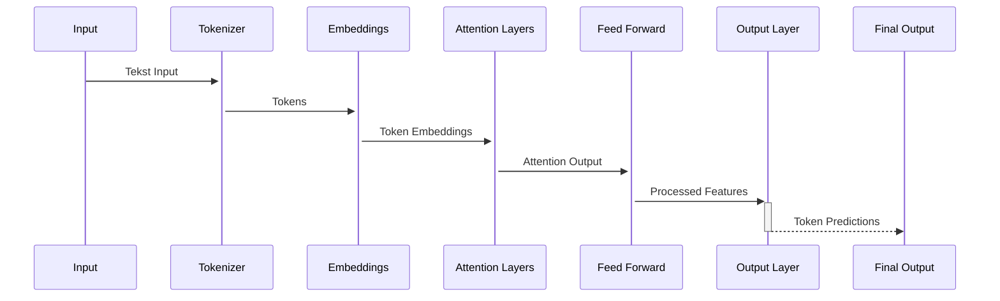
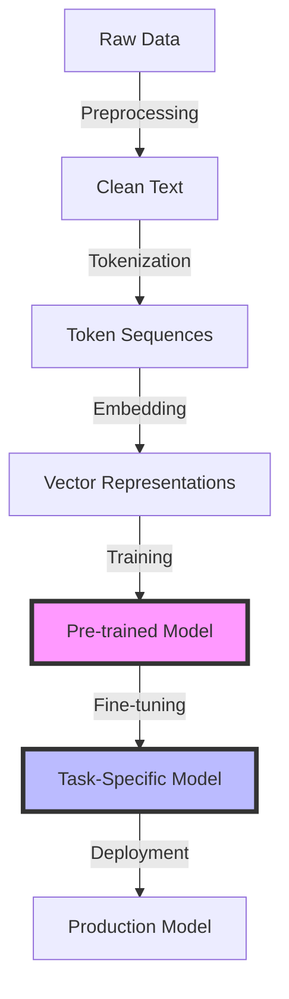
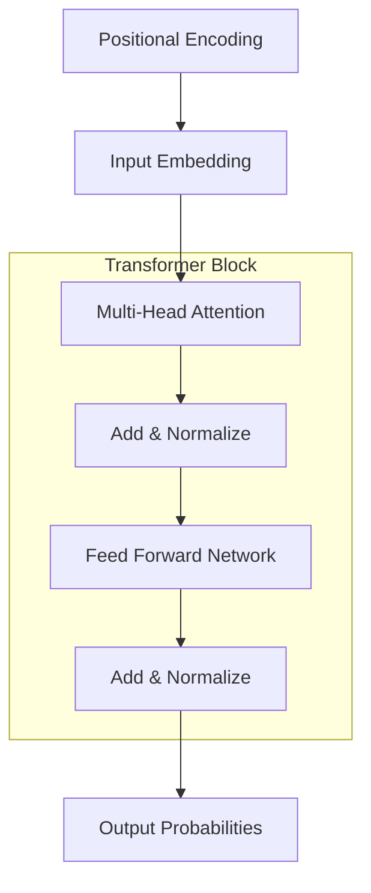

# 🧠 Large Language Models (LLMs)

## 📝 Samenvatting

Large Language Models (LLMs) zijn geavanceerde AI-modellen die natuurlijke taal kunnen begrijpen en genereren. Ze zijn getraind op enorme hoeveelheden tekstdata en kunnen verschillende taken uitvoeren, van tekstgeneratie tot vertaling en code-analyse.

## 🎯 Belangrijkste punten

- <span class="highlight-success">✓</span> Zeer veelzijdig in toepassingen
- <span class="highlight-success">✓</span> Kan complexe taken uitvoeren zonder specifieke training
- <span class="highlight-success">✓</span> Begrijpt context en nuance
- <span class="highlight-warning">⚠</span> Hoog energieverbruik bij training
- <span class="highlight-error">⚠</span> Kan hallusinaties produceren

## 🔍 Details

### Architectuur en Werking

1. <span class="highlight-info">🔄</span> **Transformer Architectuur**
   - Gebruikt self-attention mechanismen
   - Verwerkt tekst parallel in plaats van sequentieel
   - Kan lange-afstand afhankelijkheden vastleggen

2. <span class="highlight-info">📚</span> **Training Process**
   - Pre-training op grote hoeveelheden tekst
   - Fine-tuning voor specifieke taken
   - Gebruikt supervised en unsupervised learning

3. <span class="highlight-info">🎯</span> **Belangrijke Componenten**
   - Tokenizer voor tekstverwerking
   - Embeddings voor woordrepresentatie
   - Attention layers voor contextbegrip
   - Feed-forward netwerken

<div class="callout-info">
<strong>Schaalgrootte:</strong> Moderne LLMs kunnen honderden miljarden parameters bevatten
<br>
<strong>Training:</strong> Vereist vaak duizenden GPU's en meerdere weken trainingstijd
</div>

### Toepassingen

1. 📝 **Tekstgeneratie**
   - Content creatie
   - Samenvatting
   - Parafrasering

2. 💬 **Conversatie**
   - Chatbots
   - Virtual assistants
   - Customer service

3. 🔍 **Analyse**
   - Sentiment analyse
   - Topic classificatie
   - Named Entity Recognition

4. 🌐 **Vertaling**
   - Meertalige vertalingen
   - Context-aware vertalingen

## ⚠️ Beperkingen en Uitdagingen

<div class="callout-warning">
1. <strong>Hallusinaties:</strong> LLMs kunnen onjuiste informatie genereren
2. <strong>Bias:</strong> Kunnen vooroordelen uit trainingsdata overnemen
3. <strong>Computationele kosten:</strong> Training vereist significante resources
4. <strong>Privacy concerns:</strong> Risico's rond persoonlijke data in training
</div>

## 🔬 Technische Details

### Architectuur Flow



### Training Pipeline



### Transformer Architecture



### Inference Process

```mermaid
sequenceDiagram
    participant U as User
    participant T as Tokenizer
    participant M as Model
    participant D as Detokenizer
    
    U->>+T: Input Text
    T->>+M: Token IDs
    M->>M: Process Tokens
    M-->>-D: Predicted Tokens
    D-->>-U: Generated Text
```
