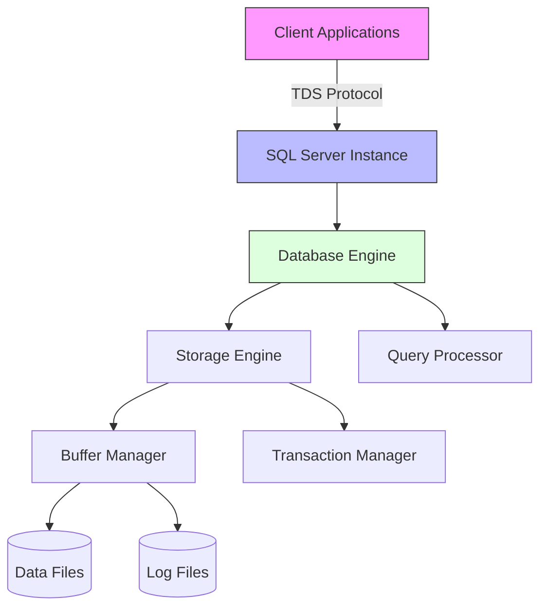
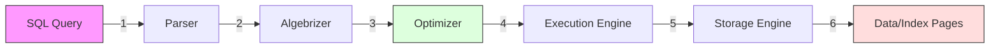
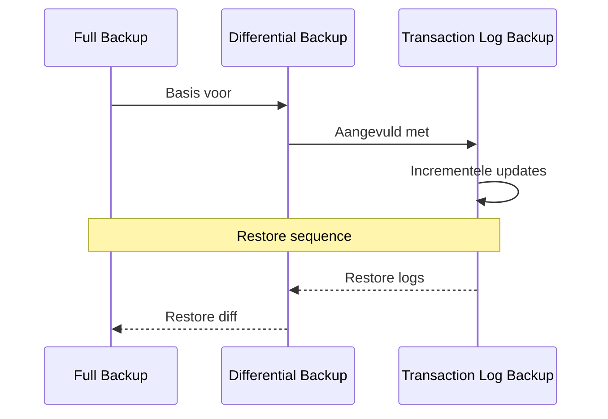

# 📚 Microsoft SQL Server

## 📝 Samenvatting

Microsoft SQL Server is een relationeel databasemanagementsysteem (RDBMS) ontwikkeld door Microsoft. Het is een van de meest gebruikte database platforms voor enterprise-oplossingen, bekend om zijn betrouwbaarheid, schaalbaarheid en uitgebreide functionaliteit.

## 🎯 Belangrijkste punten

- ✓ Uitstekende integratie met Microsoft ecosysteem
- ✓ Krachtige Business Intelligence tools
- ✓ Geavanceerde beveiligingsfuncties
- ✓ Goede schaalbaarheid
- ⚠ Relatief hoge licentiekosten
- ⚠ Beperkt tot Windows-platform (voor de meeste edities)

## 🔍 Details

> [!NOTE]+ Belangrijke componenten
> - SQL Server Database Engine
> - SQL Server Reporting Services (SSRS)
> - SQL Server Integration Services (SSIS)
> - SQL Server Analysis Services (SSAS)
> - SQL Server Management Studio (SSMS)

> [!WARNING]+ Let op
> - Zorg voor regelmatige backups
> - Monitor de database performance
> - Houd security patches up-to-date
> - Let op correct indexbeheer

## 📚 Bronnen

- [Microsoft SQL Server Documentatie](https://docs.microsoft.com/en-us/sql/)
- [SQL Server Management Studio](https://docs.microsoft.com/en-us/sql/ssms/download-sql-server-management-studio-ssms)
- [SQL Server Developer Community](https://docs.microsoft.com/en-us/sql/connect/homepage-sql-server-docs-content)

## 🔗 Gerelateerde onderwerpen

- [[T-SQL]]
- [[Database_Indexing]]
- [[SQL_Server_Security]]
- [[Database_Performance_Tuning]]

## 📝 Notities

Status: ● Actief
Prioriteit: ● Medium

## 🏷️ Tags

#database #microsoft #sql #rdbms #enterprise #data #tsql #ssms

## 📊 Visualisaties

### SQL Server Architectuur

### Query Uitvoeringsproces

### Backup Types Flow

## 📚 Bronnen

- [Microsoft SQL Server Documentatie](https://docs.microsoft.com/en-us/sql/)
- [SQL Server Management Studio](https://docs.microsoft.com/en-us/sql/ssms/download-sql-server-management-studio-ssms)
- [SQL Server Developer Community](https://docs.microsoft.com/en-us/sql/connect/homepage-sql-server-docs-content)

## 🔗 Gerelateerde onderwerpen

- [[T-SQL]]
- [[Database_Indexing]]
- [[SQL_Server_Security]]
- [[Database_Performance_Tuning]]

## 📝 Notities

Status: ● Actief
Prioriteit: ● Medium

## 🏷️ Tags

#database #microsoft #sql #rdbms #enterprise #data #tsql #ssms
