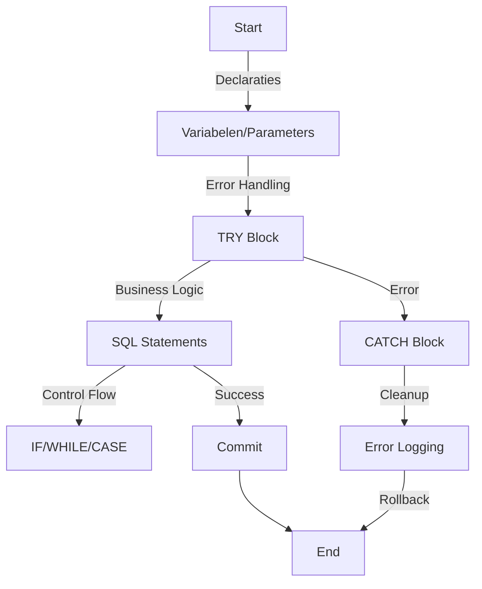
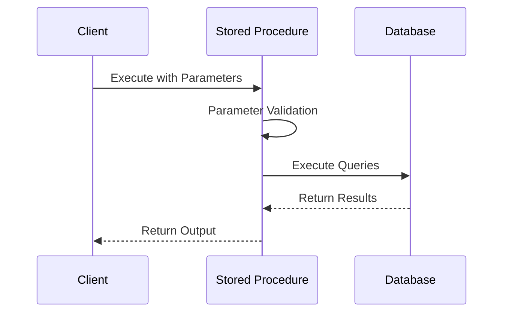

# 📚 Transact-SQL (T-SQL)

## 📝 Samenvatting

Transact-SQL (T-SQL) is Microsoft's implementatie van SQL, specifiek voor SQL Server. Het breidt de standaard SQL uit met procedurele programmering, lokale variabelen, ondersteunende functies voor string processing, datum verwerking, wiskunde, etc.

## 🎯 Belangrijkste punten

- <span style="color: #22c55e;">✓</span> Krachtige procedurele uitbreidingen op SQL
- <span style="color: #22c55e;">✓</span> Uitgebreide ingebouwde functies
- <span style="color: #22c55e;">✓</span> Goede error handling mogelijkheden
- <span style="color: #22c55e;">✓</span> Stored Procedures en Triggers
- <span style="color: #ef4444;">⚠</span> Niet volledig compatibel met andere SQL dialecten
- <span style="color: #ef4444;">⚠</span> Platform-afhankelijk (SQL Server specifiek)

## 🔍 Details

> [!NOTE]+ Belangrijke T-SQL Concepten
> - Stored Procedures
> - User-Defined Functions
> - Triggers
> - Views
> - Common Table Expressions (CTEs)
> - Transacties
> - Error Handling (TRY...CATCH)
> - Variabelen en Parameters

> [!WARNING]+ Best Practices
> - Gebruik parameters om SQL injectie te voorkomen
> - Vermijd cursors waar mogelijk
> - Gebruik SET NOCOUNT ON in stored procedures
> - Implementeer correcte error handling
> - Optimaliseer queries voor performance

## 📊 Visualisaties

### T-SQL Programma Flow


### Stored Procedure Uitvoering


## 📚 Bronnen

- [Microsoft T-SQL Reference](https://docs.microsoft.com/en-us/sql/t-sql/language-reference)
- [T-SQL Tutorial](https://docs.microsoft.com/en-us/sql/t-sql/tutorials/tutorial-writing-transact-sql-statements)

## 🔗 Gerelateerde onderwerpen

- [[MS_SQL]]
- [[SQL_Performance_Tuning]]
- [[Stored_Procedures]]
- [[Database_Triggers]]

## 📝 Notities

Status: <span style="color: #22c55e;">●</span> Actief
Prioriteit: <span style="color: #22c55e;">●</span> Hoog

## 🏷️ Tags

#tsql #sql #database #microsoft #stored-procedures #triggers #programming

## 🔍 Code Voorbeelden

```sql
-- Basis Stored Procedure Template
CREATE PROCEDURE dbo.ProcedureName
    @Param1 INT,
    @Param2 VARCHAR(50)
AS
BEGIN
    SET NOCOUNT ON;
    
    BEGIN TRY
        -- Procedure logic here
        SELECT @Param1, @Param2;
    END TRY
    BEGIN CATCH
        SELECT 
            ERROR_NUMBER() AS ErrorNumber,
            ERROR_MESSAGE() AS ErrorMessage;
    END CATCH
END;

-- Voorbeeld van een CTE
WITH RecursiveCTE AS (
    SELECT ID, ParentID, Name, 1 AS Level
    FROM Hierarchy
    WHERE ParentID IS NULL
    
    UNION ALL
    
    SELECT h.ID, h.ParentID, h.Name, r.Level + 1
    FROM Hierarchy h
    INNER JOIN RecursiveCTE r ON h.ParentID = r.ID
)
SELECT * FROM RecursiveCTE;
```
