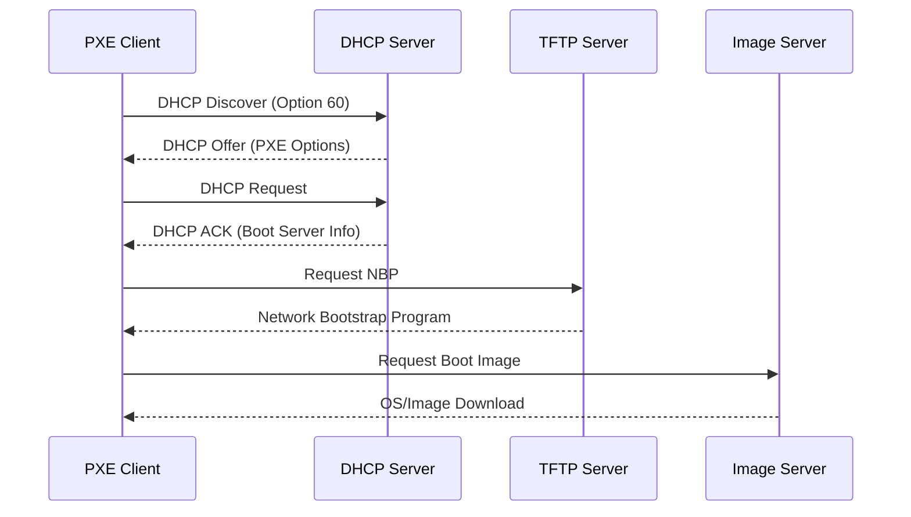
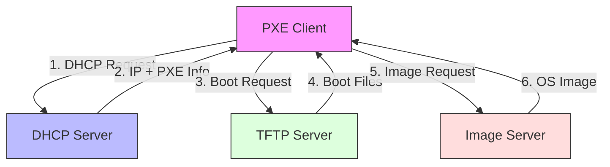

# 📚 PXE (Preboot eXecution Environment)

## 📝 Samenvatting

PXE is een industriestandaard client/server-interface die servers in staat stelt om computers via het netwerk op te starten vóór de aanwezigheid van een besturingssysteem. Het wordt veel gebruikt voor remote OS-installaties, systeemherstel en netwerk-boot scenario's.

## 🎯 Belangrijkste punten

- ✓ Maakt netwerkboot mogelijk zonder lokaal OS
- ✓ Ondersteunt geautomatiseerde OS-installaties
- ✓ Ideaal voor grote uitrolprojecten
- ⚠ Vereist specifieke netwerkconfiguratie
- ⚠ Kan beveiligingsrisico's opleveren indien niet goed geconfigureerd

## 🔍 Details

> [!NOTE]+ Vereiste componenten
> - DHCP-server met PXE-configuratie
> - TFTP-server voor boot files
> - Network Interface Card (NIC) met PXE-ondersteuning
> - Boot images en configuratiebestanden

> [!WARNING]+ Let op
> - Zorg voor goede netwerkbeveiliging
> - Configureer DHCP-opties correct
> - Test PXE-setup in gecontroleerde omgeving
> - Monitor netwerk bandbreedte tijdens grote uitrol

## 📊 Visualisaties

### PXE Boot Process

### PXE Netwerkarchitectuur

## 📚 Bronnen

- [Intel PXE Specificatie](https://www.intel.com/content/www/us/en/support/articles/000006421/technologies.html)
- [Microsoft Deployment Services](https://docs.microsoft.com/en-us/windows/deployment/windows-deployment-scenarios-and-tools)
- [Linux PXE Documentation](https://wiki.syslinux.org/wiki/index.php?title=PXELINUX)

## 🔗 Gerelateerde onderwerpen

- [[DHCP]]
- [[TFTP]]
- [[Network_Booting]]
- [[OS_Deployment]]
- [[WDS]]

## 📝 Notities

Status: ● Actief
Prioriteit: ● Hoog

## 🏷️ Tags

#netwerk #pxe #deployment #dhcp #tftp #boot #server #client
