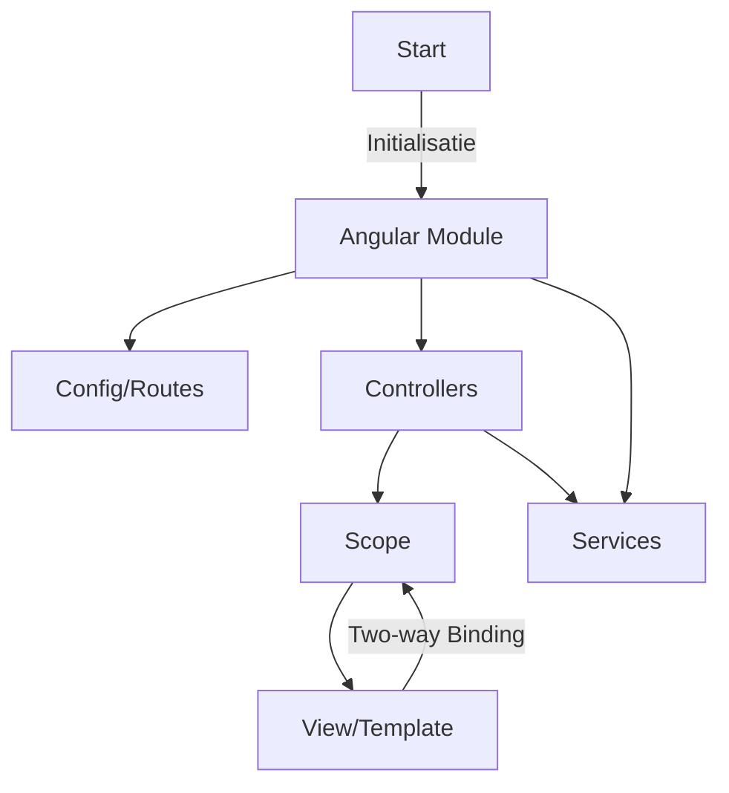
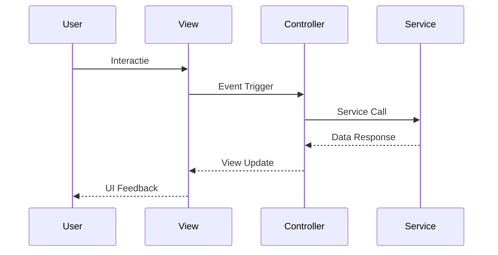
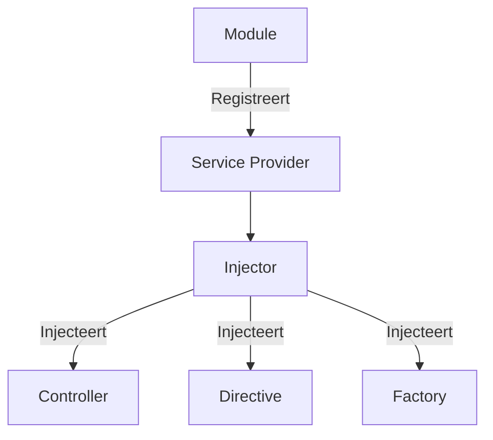

# 📚 AngularJS

## 📝 Samenvatting

AngularJS is een JavaScript-framework ontwikkeld door Google voor het bouwen van dynamische web applicaties. Het volgt het MVC (Model-View-Controller) patroon en biedt two-way data binding, dependency injection en directive functionaliteit.

## 🎯 Belangrijkste punten

- ✓ Two-way data binding voor automatische UI updates
- ✓ Dependency Injection voor betere modulariteit
- ✓ Directives voor herbruikbare componenten
- ⚠ Performance issues bij grote applicaties
- ⚠ Verouderde technologie (Angular 2+ wordt aangeraden)

## 🔍 Details

> [!NOTE]+ Belangrijke concepten
> - Scopes ($scope)
> - Controllers
> - Services
> - Directives
> - Filters
> - Modules

> [!WARNING]+ Let op
> - AngularJS (1.x) wordt niet meer actief ontwikkeld
> - Migreer naar Angular 2+ voor nieuwe projecten
> - Performance optimalisatie is cruciaal bij grote applicaties

## 📊 Visualisaties

### Architectuur Flow

### Component Interactie

### Dependency Injectie

