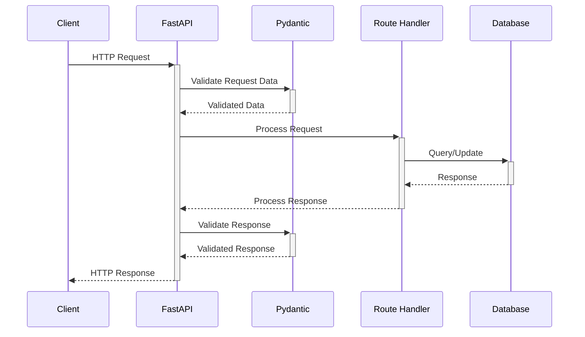
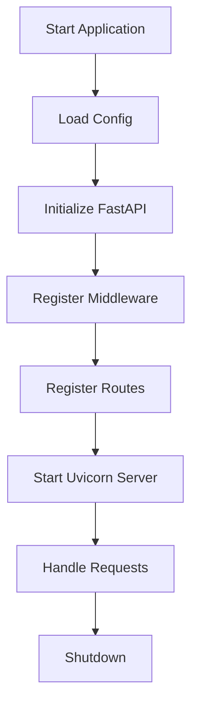
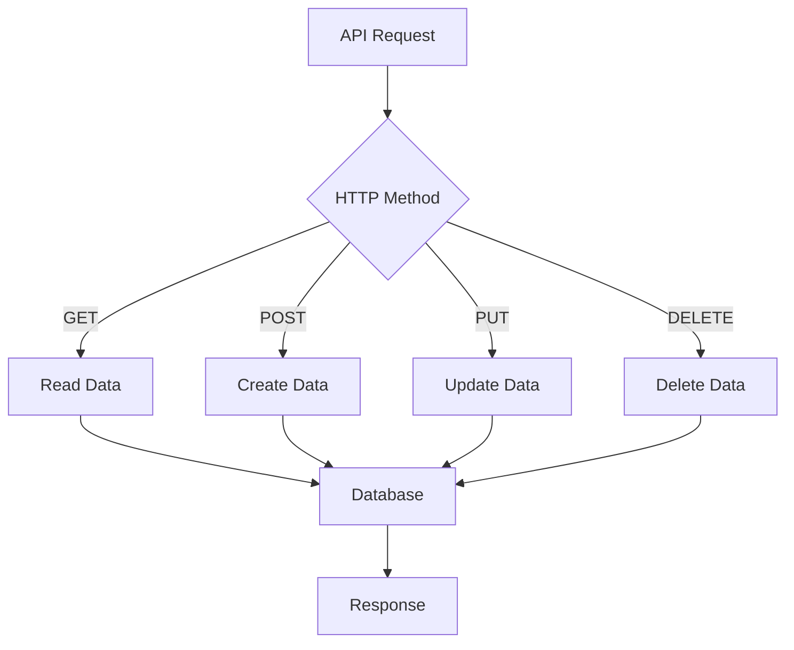

# 🚀 FastAPI

## 📝 Samenvatting

FastAPI is een modern, snel (high-performance) web framework voor het bouwen van API's met Python 3.6+ gebaseerd op standaard Python type hints.

## 🎯 Belangrijkste punten

- ⚡ Zeer hoge prestaties, op par met NodeJS en Go
- 🐛 Minder bugs: ongeveer 40% van de menselijke (programmeur) fouten worden geëlimineerd
- 💡 Intuïtief: Geweldige editor ondersteuning. Overal autocompletion. Minder tijd debuggen.
- 🎓 Eenvoudig: Ontworpen om eenvoudig te gebruiken en te leren. Minder tijd lezen docs.

## 🔍 Details

### Technische Architectuur

1. 📝 **Request Flow**

FastAPI is gebouwd bovenop Starlette voor de web delen en Pydantic voor de data delen. Het maakt gebruik van deze moderne Python features:

1. 📝 **Type Hints**: FastAPI gebruikt Python type hints voor parameter declaratie, wat resulteert in minder runtime errors en betere IDE-ondersteuning.

2. ⚡ **Async/Await**: Ondersteuning voor asynchrone code, wat de prestaties verbetert bij I/O-gebonden operaties.

3. 📚 **Automatische API-documentatie**: FastAPI genereert automatisch OpenAPI (voorheen Swagger) documentatie voor je API's.

4. 🔄 **Dependency Injection systeem**: Maakt het gemakkelijk om afhankelijkheden te beheren en code te hergebruiken.

5. 🔒 **Security en authenticatie**: Ingebouwde ondersteuning voor verschillende beveiligingsschema's.

### Pydantic Integratie

1. 🏗️ **Data Validatie & Serialisatie**
   - Pydantic zorgt voor runtime validatie van data
   - Automatische conversie van JSON naar Python objecten en vice versa
   - Type checking tijdens runtime
   - Complexe data validatie met custom validators

2. 📋 **BaseModel Gebruik**
```python
from pydantic import BaseModel

class User(BaseModel):
    id: int
    name: str
    email: str
    is_active: bool = True  # met default waarde
```

3. ✨ **Voordelen van Pydantic in FastAPI**
   - Automatische request/response validatie
   - OpenAPI schema generatie
   - IDE autocompletion support
   - Type veiligheid in je hele applicatie

4. 🛠️ **Geavanceerde Features**
   - Custom validators
   - Field aliases
   - Nested models
   - Optional fields
   - Complex type validatie

### Voorbeeld met Pydantic

```python
from fastapi import FastAPI
from pydantic import BaseModel, EmailStr, validator

class UserCreate(BaseModel):
    username: str
    email: EmailStr
    password: str
    
    @validator('password')
    def password_strength(cls, v):
        if len(v) < 8:
            raise ValueError('Password must be at least 8 characters')
        return v

app = FastAPI()

@app.post("/users/")
async def create_user(user: UserCreate):
    return {"username": user.username, "email": user.email}
```

## 💻 Praktische voorbeelden

### 1. Basis API met een GET endpoint


---


---


	
