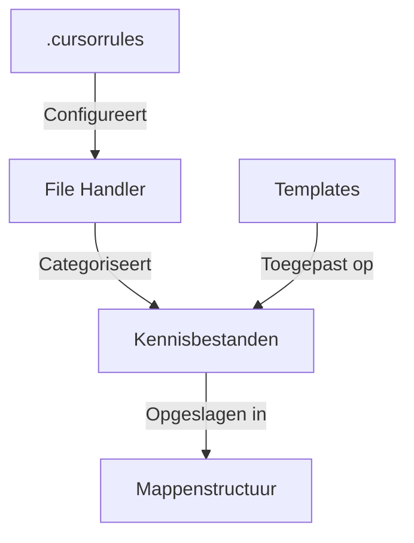
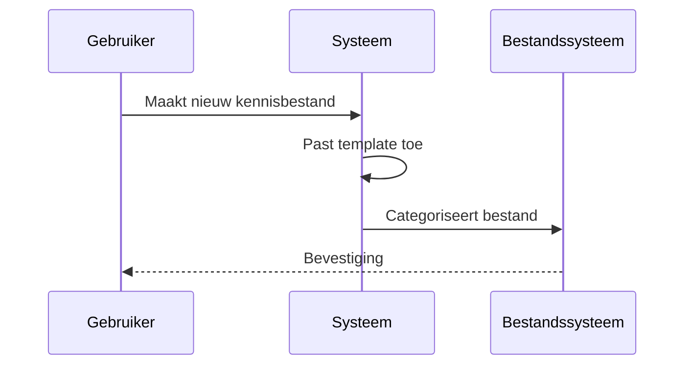

# 📚 Kennisbank Systeem Technische Documentatie

## 📝 Samenvatting

Een gedetailleerde technische beschrijving van het kennisbank systeem, inclusief de architectuur, componenten en werkwijze.

## 🎯 Belangrijkste punten

- ✓ Automatische categorisatie van bestanden
- ✓ Flexibele template structuur
- ✓ Markdown-gebaseerde documentatie
- ⚠ Vereist discipline in naamgeving en structuur

## 🔍 Details

> [!NOTE]+ Architectuur
> Het systeem is opgebouwd uit de volgende componenten:
> - .cursorrules: Configuratie voor categorisatie en templates
> - Mappenstructuur: Hiërarchische organisatie van kennis
> - Markdown bestanden: De eigenlijke kennisdocumenten

> [!WARNING]+ Belangrijke overwegingen
> - Zorg voor consistente bestandsnaming
> - Volg de template structuur
> - Gebruik de juiste tags en categorieën

## 📊 Visualisaties

### Systeem Architectuur

### Proces Flow

## 📚 Bronnen

- [Markdown Guide](https://www.markdownguide.org/)
- [Mermaid Diagramming](https://mermaid-js.github.io/)

## 🔗 Gerelateerde onderwerpen

- [[Templates]]
- [[Richtlijnen]]
- [[Markdown]]

## 📝 Notities

Status: ● Actief
Prioriteit: ● Hoog

## 🏷️ Tags

#kennisbank #systeem #documentatie #technisch
