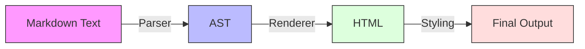
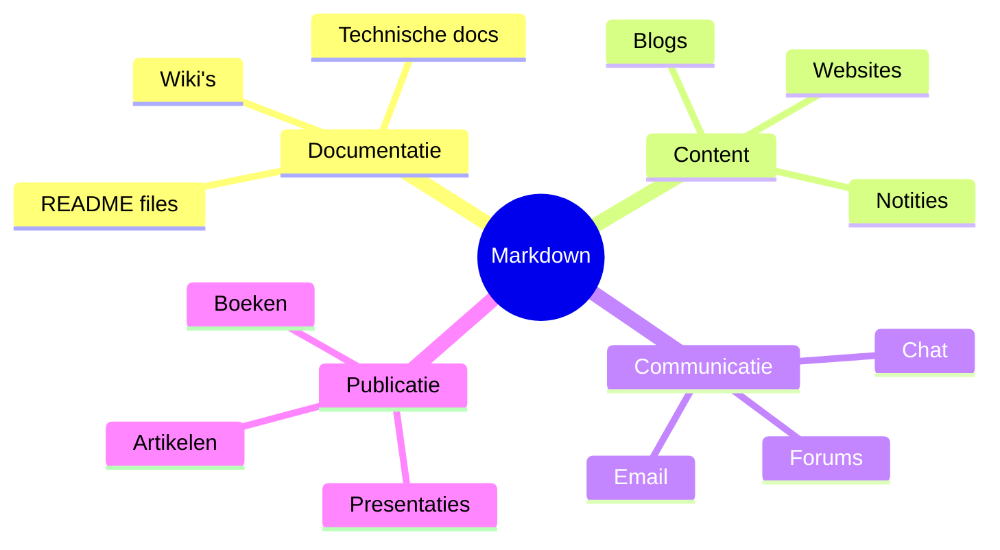

# 📚 Markdown

## 📝 Samenvatting

Markdown is een lichtgewicht markup taal ontworpen om tekst naar HTML te formatteren met een eenvoudige, leesbare syntax. Het is ontwikkeld door John Gruber en Aaron Swartz met als doel maximale leesbaarheid van de broncode te combineren met de mogelijkheid om naar HTML te converteren.

## 🎯 Belangrijkste punten

- <span style="color: #22c55e;">✓</span> Eenvoudige, leesbare syntax
- <span style="color: #22c55e;">✓</span> Platform-onafhankelijk
- <span style="color: #22c55e;">✓</span> Breed ondersteund
- <span style="color: #22c55e;">✓</span> Converteerbaar naar vele formaten
- <span style="color: #ef4444;">⚠</span> Verschillende "smaken" van Markdown
- <span style="color: #ef4444;">⚠</span> Beperkte opmaak mogelijkheden vergeleken met HTML

## 🔍 Details

> [!NOTE]+ Basis Syntax
> - Headers: # H1, ## H2, ### H3
> - Emphasis: *italic* of _italic_
> - Strong: **bold** of __bold__
> - Lists: - of 1. voor genummerde lijsten
> - Links: [tekst](url)
> - Images: 
> - Code: `inline code` of ```codeblocks```
> - Blockquotes: > quote

> [!WARNING]+ Veel voorkomende uitbreidingen
> - Tabellen
> - Takenlijsten
> - Doorgestreepte tekst
> - Voetnoten
> - Emoji's
> - Wiskundige formules (LaTeX)
> - Mermaid diagrammen

## 📊 Visualisaties

### Markdown Conversie Flow


### Markdown Gebruik Cases


## 🔍 Voorbeelden

```markdown
# Hoofdtitel

## Subtitel

Dit is een **belangrijke** tekst met *emphasis*.

### Lijst
- Item 1
- Item 2
  - Sub-item 2.1
  - Sub-item 2.2

### Code
```python
def hello_world():
    print("Hello, World!")
```

### Tabel
| Kolom 1 | Kolom 2 |
|---------|---------|
| Data 1  | Data 2  |
```

## 📚 Bronnen

- [Original Markdown Specification](https://daringfireball.net/projects/markdown/)
- [GitHub Flavored Markdown](https://github.github.com/gfm/)
- [CommonMark Specification](https://commonmark.org/)

## 🔗 Gerelateerde onderwerpen

- [[Obsidian]]
- [[Documentation_Writing]]
- [[Technical_Writing]]
- [[Content_Management]]

## 📝 Notities

Status: <span style="color: #22c55e;">●</span> Actief
Prioriteit: <span style="color: #22c55e;">●</span> Hoog

## 🏷️ Tags

#markdown #documentatie #writing #formatting #content #technical-writing
