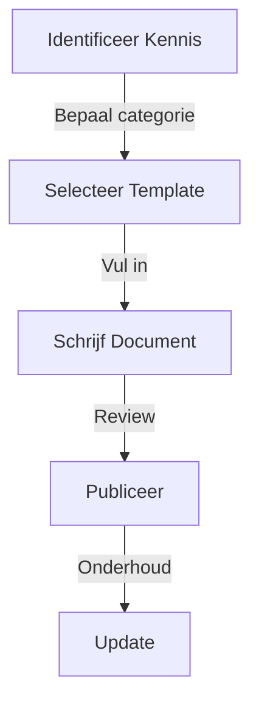
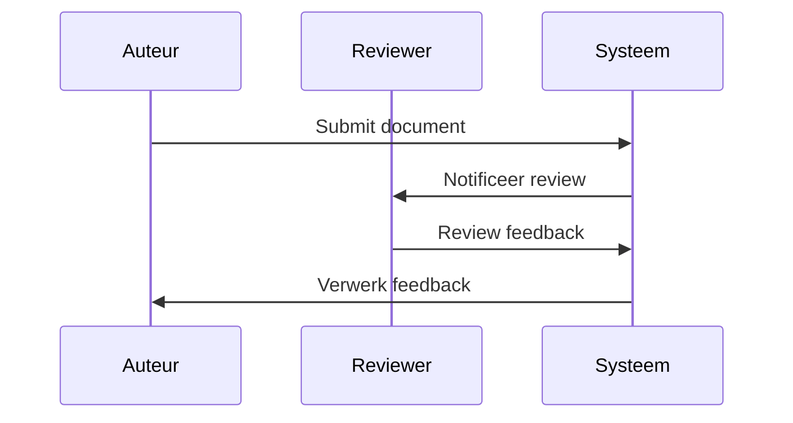

# 📚 Richtlijnen

## 📝 Samenvatting

Best practices en richtlijnen voor het effectief documenteren en beheren van kennis binnen het kennisbank systeem.

## 🎯 Belangrijkste punten

- ✓ Consistente documentatie
- ✓ Duidelijke categorisatie
- ✓ Effectieve kennisdeling
- ⚠ Regelmatig onderhoud nodig

## 🔍 Details

> [!NOTE]+ Documentatie Richtlijnen
> 1. Gebruik duidelijke, beschrijvende titels
> 2. Categoriseer correct
> 3. Voeg relevante tags toe
> 4. Houd documenten up-to-date
> 5. Link gerelateerde documenten

> [!WARNING]+ Veel voorkomende fouten
> - Inconsistente naamgeving
> - Ontbrekende metadata
> - Verouderde informatie
> - Onjuiste categorisatie

## 📊 Visualisaties

### Documentatie Proces

### Kwaliteitscontrole

## 📚 Bronnen

- [Documentatie best practices]
- [Knowledge management guides]

## 🔗 Gerelateerde onderwerpen

- [[Kennisbank_Systeem]]
- [[Templates]]
- [[Style_Guide]]

## 📝 Notities

Status: ● Actief
Prioriteit: ● Hoog

## 🏷️ Tags

#richtlijnen #best-practices #documentatie #kwaliteit
