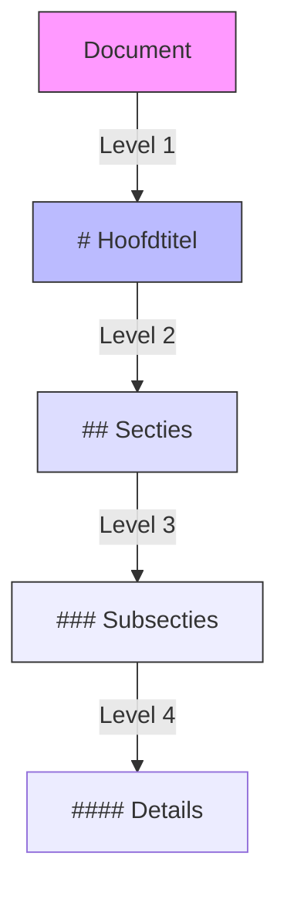
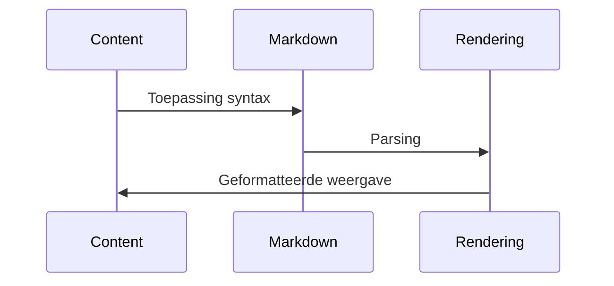

# 📚 Markdown Style Guide

## 📝 Samenvatting

Een complete gids voor de markdown styling conventies binnen het kennisbank systeem, inclusief opmaak regels en best practices.

## 🎯 Belangrijkste punten

- ✓ Consistente opmaak over alle documenten
- ✓ Verbeterde leesbaarheid
- ✓ Gestandaardiseerde emoji gebruik
- ⚠ Vereist kennis van Markdown syntax

## 🔍 Details

> [!NOTE]+ Markdown Basis Regels
> - Gebruik headers met emoji prefixes (# 📚, ## 📝, etc.)
> - Laat één lege regel tussen secties
> - Gebruik backticks voor `code snippets`
> - Gebruik drie backticks voor code blocks met taal specificatie
> - Gebruik blockquotes (>) voor belangrijke notities
> - Gebruik lijsten met - voor opsommingen

> [!WARNING]+ Emoji Conventies
> - 📚 Voor hoofdtitels
> - 📝 Voor samenvattingen en notities
> - 🎯 Voor belangrijke punten
> - 🔍 Voor details
> - 📊 Voor visualisaties
> - 🔗 Voor links en referenties
> - 🏷️ Voor tags

## 📊 Visualisaties

### Markdown Hiërarchie

### Opmaak Flow

## 📚 Bronnen

- [GitHub Markdown Guide](https://docs.github.com/en/get-started/writing-on-github/getting-started-with-writing-and-formatting-on-github/basic-writing-and-formatting-syntax)
- [Markdown Cheatsheet](https://www.markdownguide.org/cheat-sheet/)

## 🔗 Gerelateerde onderwerpen

- [[Richtlijnen]]
- [[Templates]]
- [[Kennisbank_Systeem]]

## 📝 Notities

Status: ● Actief
Prioriteit: ● Hoog

## 🏷️ Tags

#markdown #styling #documentatie #richtlijnen #opmaak
