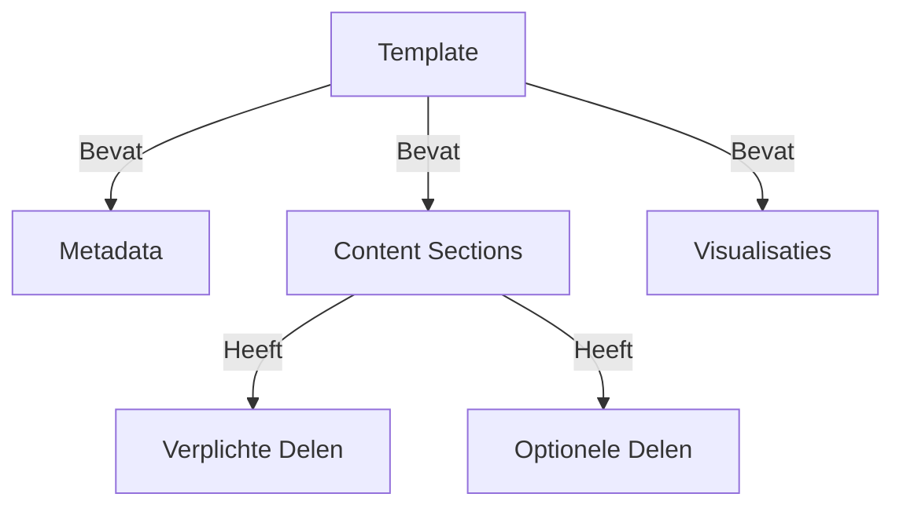
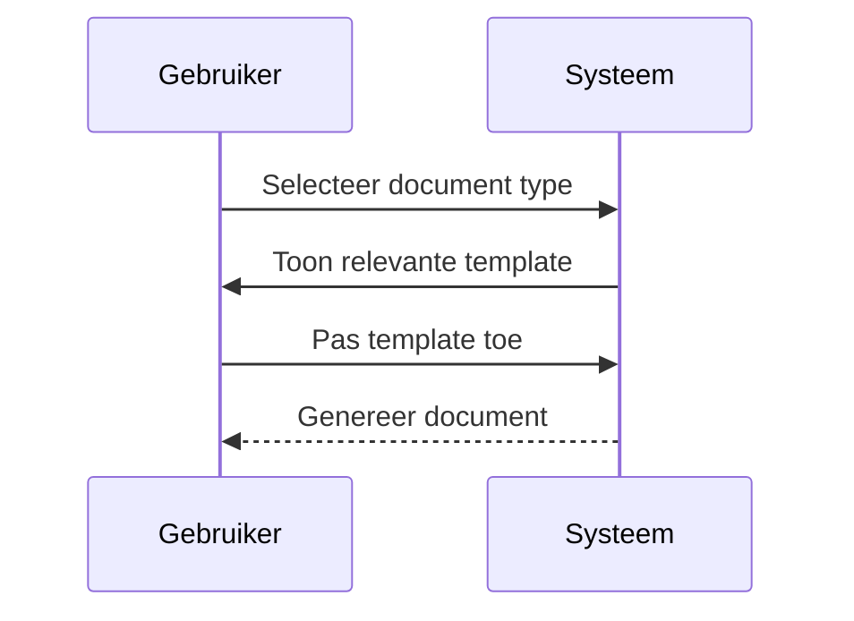

# 📚 Templates

## 📝 Samenvatting

Overzicht van alle beschikbare templates in het kennisbank systeem en hun gebruiksrichtlijnen.

## 🎯 Belangrijkste punten

- ✓ Gestandaardiseerde opmaak
- ✓ Flexibel aan te passen
- ✓ Ingebouwde visualisatie ondersteuning
- ⚠ Templates moeten consistent gebruikt worden

## 🔍 Details

> [!NOTE]+ Beschikbare Templates
> 1. Standaard kennisbestand
> 2. Project documentatie
> 3. Technische specificatie
> 4. Onderzoeksrapport

> [!WARNING]+ Template Gebruik
> - Behoud de basis structuur
> - Pas secties aan waar nodig
> - Verwijder geen verplichte elementen

## 📊 Visualisaties

### Template Structuur

### Template Selectie Flow

## 📚 Bronnen

- [Template documentatie]
- [Markdown styling guide]

## 🔗 Gerelateerde onderwerpen

- [[Kennisbank_Systeem]]
- [[Richtlijnen]]
- [[Markdown_Styling]]

## 📝 Notities

Status: ● Actief
Prioriteit: ● Medium

## 🏷️ Tags

#templates #documentatie #richtlijnen
